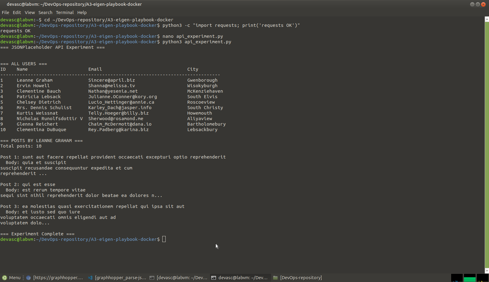

# Ap3 – Eigen API-experiment (Python)

## Beschrijving
Python-script dat de JSONPlaceholder REST API gebruikt.
Het haalt alle gebruikers op en toont de posts van de eerste gebruiker.

## Gebruikte API
- URL: https://jsonplaceholder.typicode.com
- Geen API key vereist

## Endpoints
| Methode | Endpoint        | Beschrijving              |
|---------|-----------------|---------------------------|
| GET     | /users          | Alle gebruikers ophalen   |
| GET     | /posts?userId=1 | Posts van een gebruiker   |

## Uitvoering
```bash
python3 api_experiment.py
```

## Screenshot

