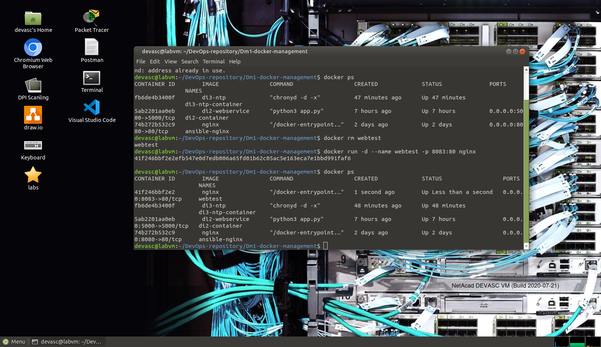
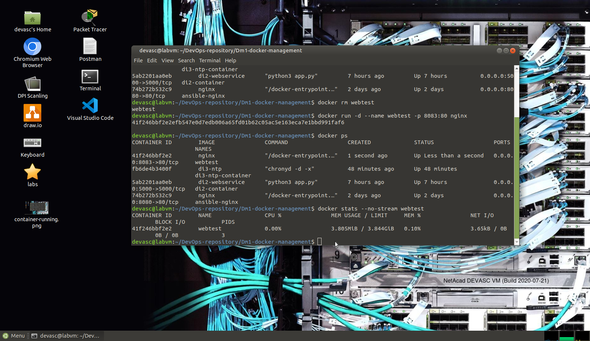
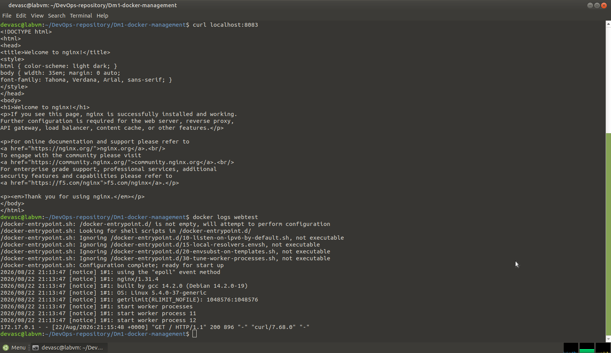
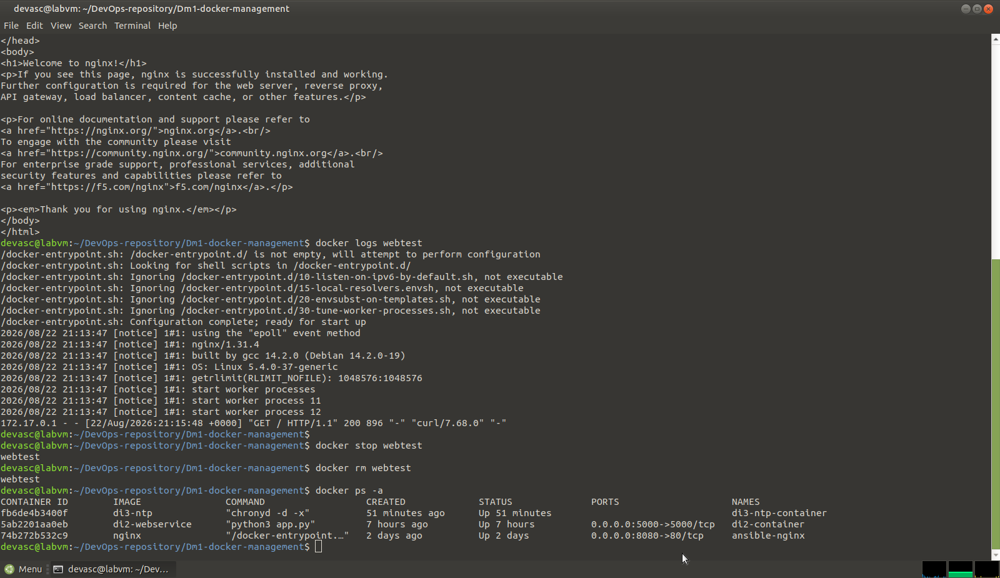
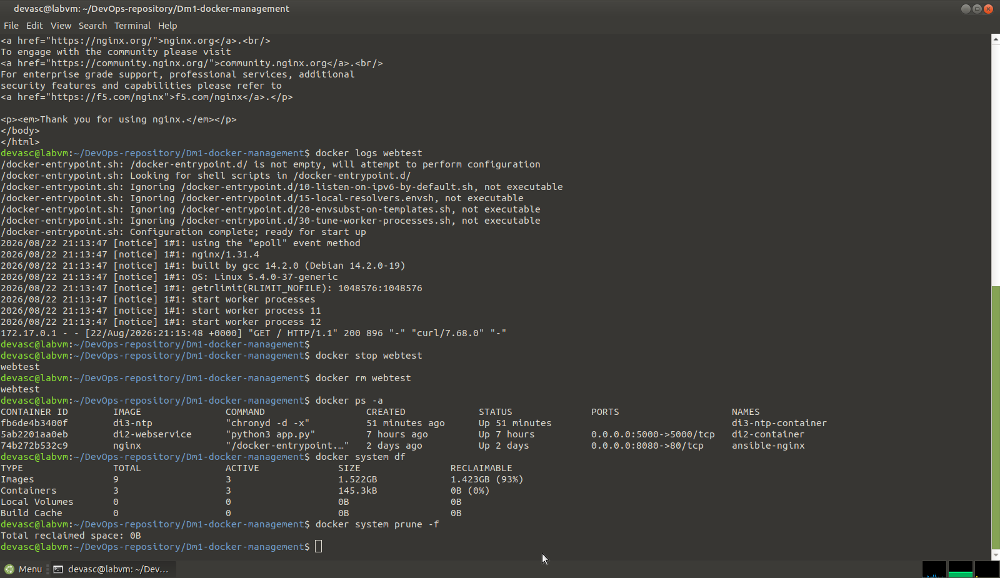

# Dm1 – Docker Management Experiment

Basisbeheer van een Docker-container: opstarten, monitoren, logs bekijken en opruimen.

## Stappen

1. **Container starten**

docker run -d --name webtest -p 8083:80 nginx
docker ps

   

2. **Resourcegebruik bekijken**

docker stats --no-stream webtest

   

3. **Logs bekijken**

curl localhost:8083
docker logs webtest

   

4. **Container stoppen en verwijderen**

docker stop webtest
docker rm webtest
docker ps -a

   

5. **Systeem opruimen**

docker system df
docker system prune -f

   

## Conclusie

Dit experiment toont de basiscommando's voor het beheren van een Docker-container doorheen zijn levenscyclus: starten, monitoren, en opruimen.
